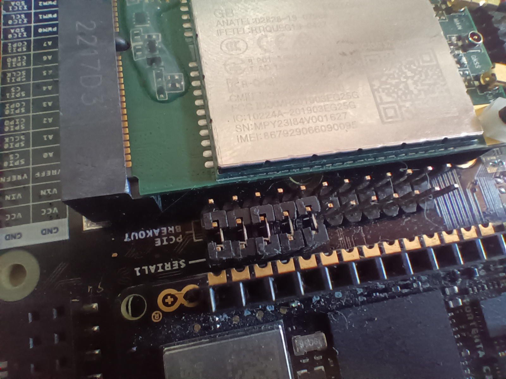

# 📡 Arduino Cellular 

[](https://github.com/arduino-libraries/Arduino_Cellular/actions/workflows/arduino-lint.yml) [](https://github.com/arduino-libraries/Arduino_Cellular/actions/workflows/compile-examples.yml) [](https://github.com/arduino-libraries/Arduino_Cellular/actions/workflows/spell-check.yml) [](https://github.com/arduino-libraries/Arduino_Cellular/actions/workflows/sync-labels.yml) [](https://github.com/arduino-libraries/Arduino_Cellular/actions/workflows/render-documentation.yml)


This library provides a toolkit for interacting with the official Arduino 4G Modules ([EMEA](https://store.arduino.cc/products/4g-module-emea) and [Global Versions](https://store.arduino.cc/products/4g-module-global)). 
It allows you to connect to the internet, send and receive SMS messages, and get location from the cellular network or GPS. 

## Examples
* [DeleteSMS](examples/DeleteSMS) - Example that shows how to delete SMS.
* [GetLocation](examples/GetLocation) - Shows how to get the current GPS location.
* [GetTime](examples/GetTime) - Use GPS to acquire the time of the device.
* [HTTPClient](examples/HTTPClient) - Example of using this library together with [ArduinoHttpClient]() to connect to a web server
* [HTTPSClient](examples/HTTPSClient) - Example of using this library together with [ArduinoHttpClient]() that uses [BearSSL]() under the hood to create a secure connection to a web server
* [ModemTerminal](examples/ModemTerminal) - A handy example for debugging and Testing AT commands 
* [ReceiveSMS](examples/ReceiveSMS) - Example for the SMS sending and receiving functionality 
* [SendSMS](examples/SendSMS) - Shows how to send an SMS

## ✨ Features
* Fast 4G connection to the internet
* Secure SSL connections with BearSSL
* Get location using GPS or GSM
* Synchronise time with the cell provider
* Send and Receive SMS Messages

## 👀 Instructions
1. Insert your Arduino 4G module to the [Arduino Portenta Mid Carrier](https://store.arduino.cc/collections/portenta-family/products/portenta-mid-carrier)
2. Insert a valid SIM card either in the **PCIE_SIM** connector on the Portenta Mid Carrier
3. Connect the 5 **SERIAL1** header pins to their corresponding pins on the **PCIE_BREAKOUT** header using jumpers

4. Connect the **3V3 PCIE** pin to the **3V3 Buck** 

5. Connect external power to the Mid Carrier, via the **VIN** (5V) because modems use a lot of power when connecting or getting a GPS location. Make sure your supply can handle around 3A. 
6. Get the APN settings from your network operator and add them to the "arduino_secrets.h" file for each sketch
```cpp
const char apn[]      = "live.vodafone.com";
const char gprsUser[] = "live";
const char gprsPass[] = "";
```
7. Install the library and it's dependencies 
8. Enjoy

## 📖 Documentation

For more information about this library please read the documentation [here](./docs).
